
# PandoraBox

    * Team Number: 04
    * Team Name: Crazy Thursday
    * Team Members: Zheyu Li, Zhuozi Xie
    * Github Repository URL: https://github.com/ese5160/a14g-final-submission-s25-t04-crazy-thursday.git
    * GithubPage Repository URL: https://github.com/ZheyuLi-SEAS/crazythursday.github.io/tree/main
    * GithubPage URL: https://zheyuli-seas.github.io/crazythursday.github.io/
    * Description of test hardware: SAMW25 on custom PCBA, Windows Laptop (Microchip Studio)

## 1. Video Presentation

Link to the video: https://youtu.be/bRq8x4013wI

## 2. Project Summary

### 2.1 Device Description

- Describe our device in 2 sentences

    A phone locker that can lock your phone when you need to focus on your work. Set the learning time through our webUI, put the phone in the locker and it can't be taken out until the learning time has ended.

- What inspired we to do the project? What problem is our device solving?

    Many of us get distracted by our phones while studying, apps like TikTok and YouTube can be especially addictive. To help improve focus, we developed a timed locking box that securely holds your phone during study sessions, allowing you to concentrate without interruptions.

- How do we use the Internet to augment your device functionality?

    We use the Internet to enhance our device functionality by integrating it with a web interface, Node-Red, that allows users to remotely set study durations, monitor progress, and receive reminders.

### 2.2 Device Functionality

Our internet-connected device is designed with a modular task-based architecture to manage study sessions effectively. It uses an IR sensor to detect if a phone is placed inside the box, an IMU to monitor movement during study, and a supplementary limit switch to help detect the phone being placed inside the box. The electromagnetic lock secures the box, while a buzzer and LCD screen provide audio and visual feedback to the user. A button allows users to manually cancel sessions for emergency use. All these components are coordinated through a central System Control Task, which processes sensor data, user inputs, and commands from the WiFi Task. Through WiFi, the device connects to the Internet, enabling users to set lock durations, receive progress updates, and manage sessions remotely using Node-RED. This design ensures a seamless integration between hardware functionality and internet-based control.

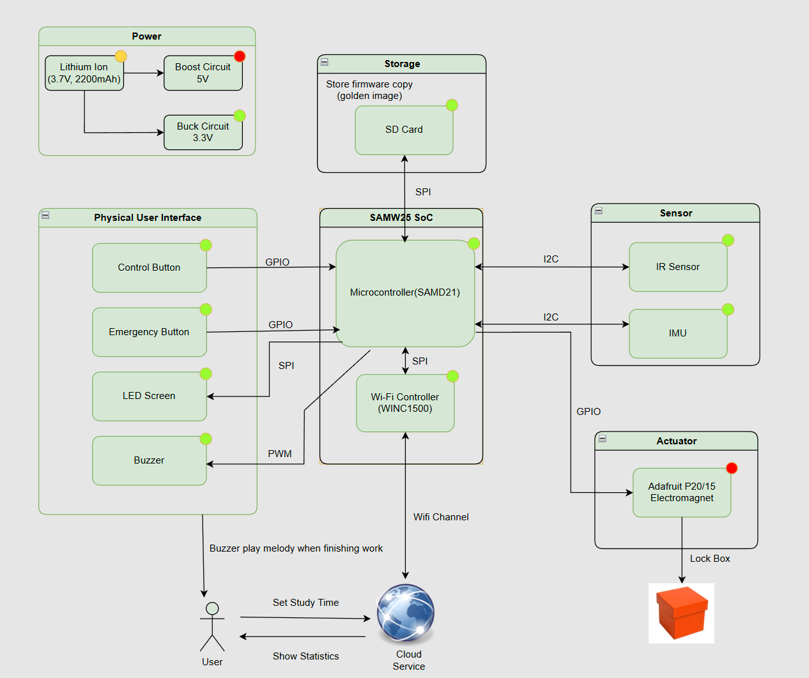

### 2.3 Challenges

- Where did we face difficulties? This could be in firmware, hardware, software, integration, etc.

    We faced several challenges across both hardware and software components. On the hardware side, the biggest challenge is the weird behavior of SD card module. The firmware was test correctly on dev board. However, on our custom PCB, the SD card module cannot be initialized correctly(In fact, the SD card module alternates initialisation successes and failures after each MCU reset, which looks very much like a software rather than a hardware problem).

    In terms of software, we encountered issues with firmware updates from the cloud, as neither the CLI commands nor the web-based instructions worked reliably. Additionally, we experienced stack overflows and memory limitations, since the system had only 32KB of RAM, which led to instability and task crashes during runtime.

- How did we overcome these challenges?

    To resolve the SD card issue, we carefully debug the PCB (it should be hardware issue since firmware perform good on dev board). We spent a day debugging, but didn't pinpoint the cause, and due to time constraints, moved on to continue testing and integrating other modules. It wasn't until debugging a nearby switch debouncing circuit that another strange phenomenon was discovered, the switch pins could not be pulled high. By carefully comparing the PCB design and the real thing, we realised that a set of very close capacitors and 0-ohm resistors had been soldered backwards by the manufacturer.

    Fixing this is as simple as re-soldering. But the process of analysing why it happened afterwards is very helpful. The switch was not pulling high because the path that should have been through the capacitor to ground became through the resistor, causing the switch to pull consistently low. The SD card, on the other hand, is a bit more interesting. The module is not completely unable to read and write properly, as the incorrectly soldered capacitor amounts to turning this trace (CIPO/MISO for SPI) into an RC series low-pass filter. The signal on this trace (MISO) is close to a square wave of variable period (depending on the message sent). Due to the voltage jumps on the rising and falling edges, it actually contains a lot of frequency components, and the high frequency components can't get through. Therefore, depending on the information being transmitted, some signals pass through properly and others do not in the relatively low frequency (MHz) SPI communication of this project, causing this strange phenomenon.

    To address memory constraints, we optimized usage by reducing task stack sizes, minimizing global variables, and increasing the FreeRTOS heap size manually to prevent allocation issues. We spent significant time fine-tuning task sizes to maintain a balance between functionality and stability. Additionally, for variables used only within local scopes, we added the const qualifier to store them in flash memory instead of consuming RAM. Regarding the firmware update failures, we believe they were caused by memory leaks. After optimizing memory usage, this issue was resolved automatically.

### 2.4 Prototype Learnings

- What lessons did we learn by building and testing this prototype?

    We learned that using a logic analyzer is extremely helpful for debugging, as it allows us to see exactly what’s happening on the chip and determine whether issues are caused by hardware or software. We also discovered the importance of thoroughly reading datasheets, which helped us understand how to properly configure and use various components. Searching for related examples online and on GitHub gave us valuable insights into how others approached similar problems and inspired our own code design. Finally, we realized that power management is a critical aspect of embedded system design, especially when working with module requiring stable power supply like WiFi chip WINC1500 on this board.

- What would we do differently if we had to build this device again?

    If we were to build this device again, we would use a bistable linear solenoid instead of an electromagnet, as it consumes less power thus cause less heat dissipation. At the same time, the sudden change in current caused by the solenoid switching will affect the voltage stability of the whole PCB, and from this point of view, this is also an important reason to replace this module.

### 2.5 Next Steps & Takeaways

- What steps are needed to finish or improve this project?

    To improve this project, we plan to synchronize the device with cloud storage or Google Calendar to automatically log study sessions and help users track their productivity over time. We also aim to enhance the LCD display by showing more detailed information, such as better anime for remaining study time, session progress, and status messages, to provide a better user experience. Additionally, we would integrate a power switch to turn device on/off without plugging battery.

   We're also thinking of adding wireless charging, which will allow you to charge your phone while it's locked. This broadens the application scenarios of the product, for example, it can replace mobile phone charging stations in airports.

- What did we learn in ESE5160 through the lectures, assignments, and this course-long prototyping project?

    ESE5160 gave us a comprehensive, hands-on experience in embedded systems development—from concept to completion. We learned how to translate an idea into a concrete engineering goal. And how to choose appropriate components based on functionality, size, power consumption, and communication interfaces. Through lectures and assignments, we gained valuable skills in schematic design and PCB layout, which were both entirely new to us. Designing a PCB for the first time helped us understand the importance of pin assignments, trace routing, and physical board constraints.

    Once the PCB was manufactured, we experienced the challenges of hardware bring-up—testing the board, debugging connections, and integrating sensors, actuators, and microcontrollers. We also learned to use tools like logic analyzers, oscilloscopes, and serial debuggers to troubleshoot hardware-software interactions. Through the prototyping project, we appreciated the value of modular task-based firmware design based on FreeRTOS, effective memory management, and real-world trade-offs between complexity, power, and performance. Overall, this course gave us the full product development experience and greatly improved our confidence in building real embedded systems.

### 2.6 Project Links

URL to the Node-RED instance:

http://172.191.68.14:1880/ui/

Share link to our final PCBA on Altium 365:

https://upenn-eselabs.365.altium.com/designs/2072B8AC-2960-444A-B440-9D8EECED0507

## 3. Hardware & Software Requirements

### HRS

- HRS 01 – Project shall be based on SAM W25 microcontroller (WiFi supported).

    The MCU on the custum PCBA is SAM W25.

- HRS 02 – An IR sensor(via I2C) shall be used for phone detection. The sensor shall be able to accurately detect distances in the range of 1-10cm.

    The IR sensor we use is VCNL4010, it worked best at distances of about 10-150mm(1-15cm). It perfectly match our requirement for detecting distance in a small box.

- HRS 03 – An 5V DC electromagnet with at least 2.5kg holding force shall be used to support the lock mechanism.

    The electromagnet we use is Adafruit 3872, it powered by 5VDC with Holding Force: 2.5 Kg / 5.5 lb. This also perfectly match our requirement.

- HRS 04 – An LCD display shall be used for user interface. The display shall communicate with the microcontroller via SPI.

    The LCD we use is Adafruit 1480, which is a 2.2inch 18-bit color TFT LCD display with microSD card breakout & EYESPI Connector. It communicate with MCU through SPI.

- HRS 05 – A passive buzzer that releases sounds of different frequencies shall be used.

    The buzzer we use is "PUI Audio SMT-0540-S-2-R." It can play sound 75dB with in the range of 3500 to 4500 Hz.

- HRS 06 - A Li-Ion battery (3.7V nominal voltage) Shall be used as the power supply of the whole system.

    The Li-Ion battery we use is “ICR18650 2200mAh 3.7V.” The Nominal Voltage is 3.7V, Charging Cut-off Voltage 4.2V, and Discharge Cut-off Voltage 3.0V.

- HRS 07 - A limit switch shall be used with IR sensor to cross validate that the cell phone is placed in the box

    Due to the design of the enclosure, the limit switch cannot be touched properly, so this module is not used in the actual project.

- HRS 08 - A 6-DOF IMU supporting I2C connection shall be used to detect whether the box has been moved or not，>10Hz sample rate is enough.

    The IMU we use is LSM6DSO. For this application, we use 104Hz reading frequency for both accelerometer and gyroscope in IMU.

### SRS

- SRS 01 – The IR sensor and limit switch shall continuously detect the presence of objects inside the box when the time is set and before the box is closed(in Prepare Stage).

    We change our logic here, that IR sensor only enable detection when we hit the start command. It will keep detect the availability of the phone in a time range. If the phone is there in the time, the box will lock and disable the IR sensor. If not, we will back to prepare stage and wait for another command for the cloud. This method is more energy and mcu resource efficient. Due to the design of the case work, we finally choose not use the limit switch.

- SRS 02 - The Device shall receive commands from mobile phones using WiFi.

    We use mqtt to send commands from the cloud to mcu and vice versa, which means we can use both PC and phone to send commands.

- SRS 03 - The box shall support setting study time using mobile phone (based on WiFi connection).

    We have a scroll pad on NodeRed to choose and setting time.

- SRS 04 - The electromagnet shall be controlled according to the status of IR sensor, limit switch and emergency release button.

    The electromagnet will keep working during the time we setting. It will lock when start command received and IR sensor detect phone. It will unlock if we press the emergency release button at the bottom of the box.
    The limit switch do not participate the locking process.

- SRS 05 - The buzzer should play sound to inform the user to study when reaching the scheduled study time.

    This is the task we plan to do to improve our project. Connecting our cloud with Google calendar will help us setting study time.

- SRS 06 - The buzzer should play sound to inform the user to rest when the setting time period end.

    We played the melody of "Happy Birthday Song" to info the user time end.

- SRS 07 - IMU's reading should determine the LCD on/off based on the box gesture during lock state.

    Due to PCB design issues, we are unable to control the power input pin of the LCD display through the MCU. This is also something we think we can do in the future to improve the project (by adding transistor to control Vin pin). Turn the LCD off when we not focus on it will save the power and increase usage time.

## 4. Project Photos & Screenshots

Required photos and screenshots include:

- Final Project:

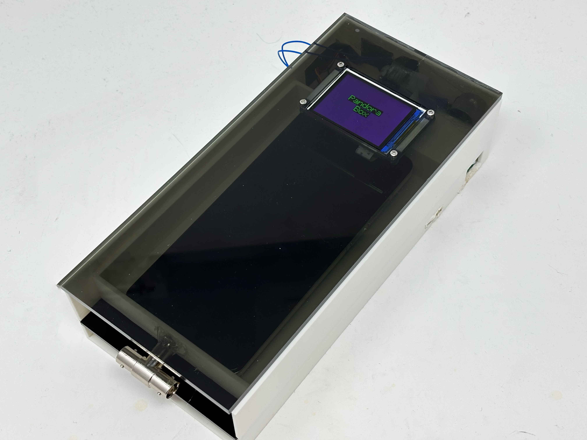

- The standalone PCBA, top

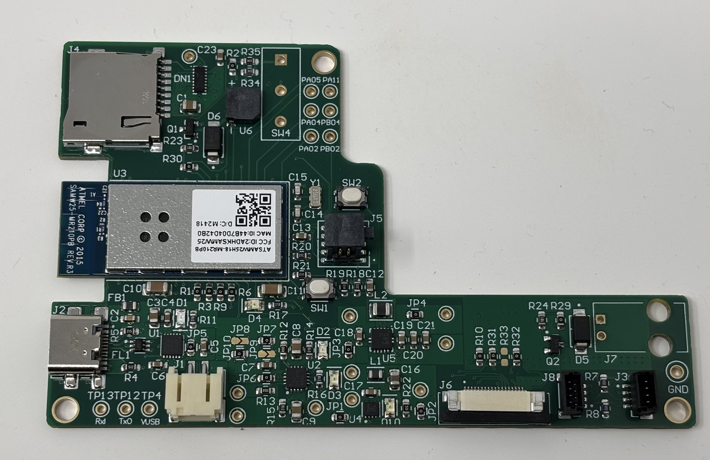

- The standalone PCBA, bottom

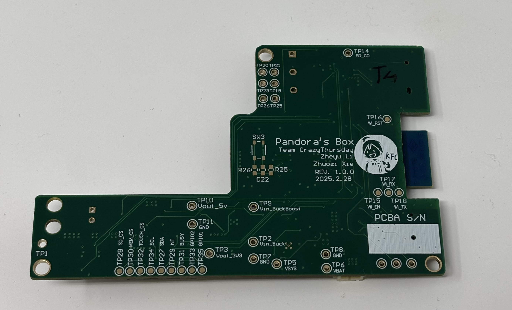

- Thermal camera images while the board is running under load:

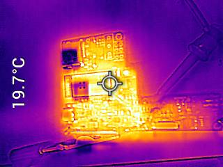

- The Altium Board design in 2D view

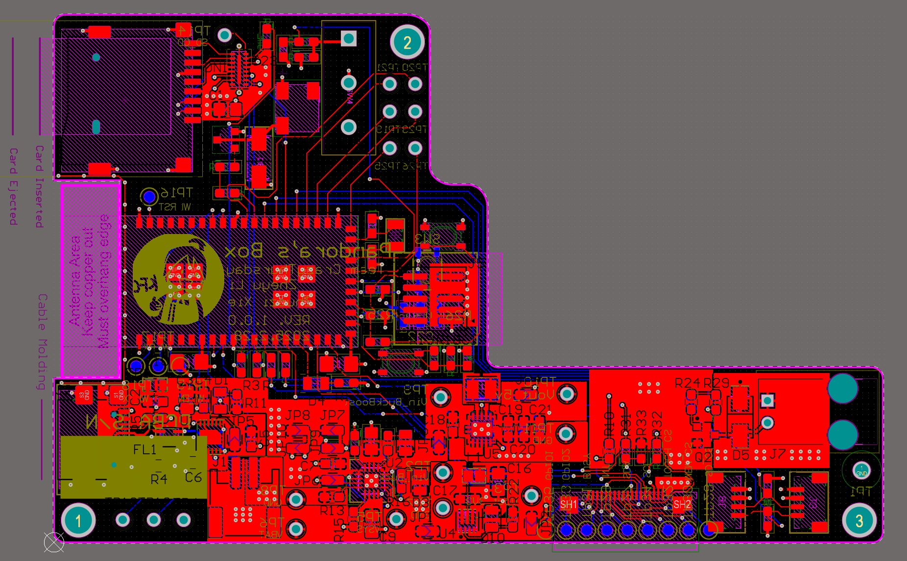

- The Altium Board design in 3D view

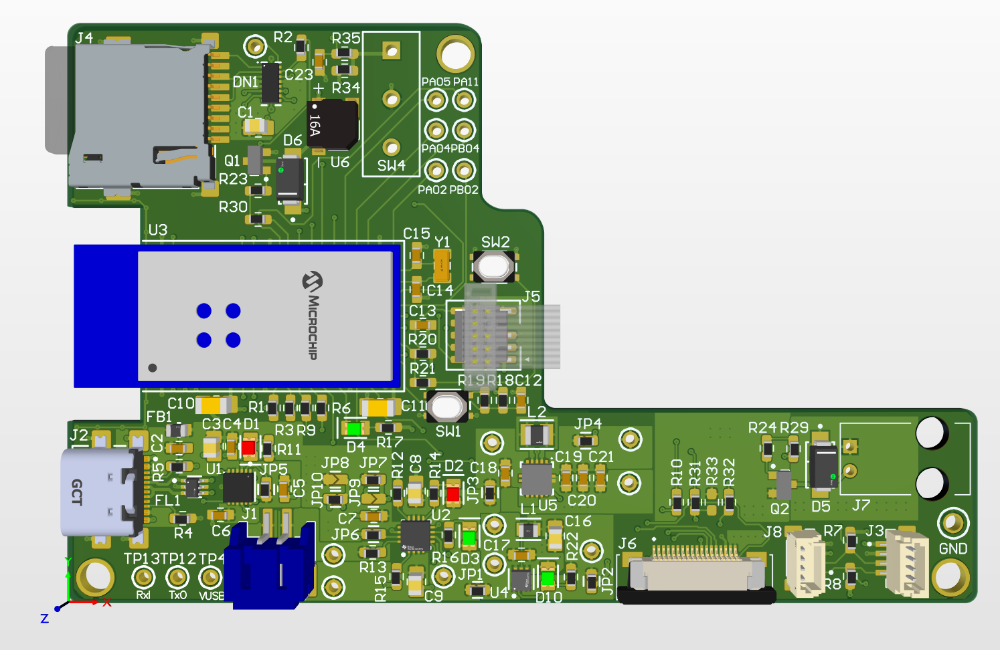

- Node-RED dashboard(Phone view)

### Node-RED dashboard (Phone view)

  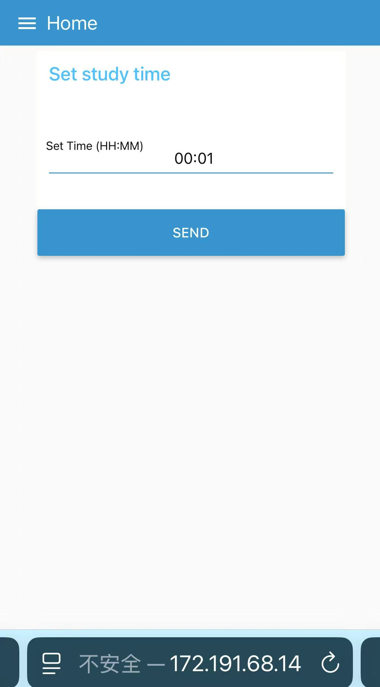
  
  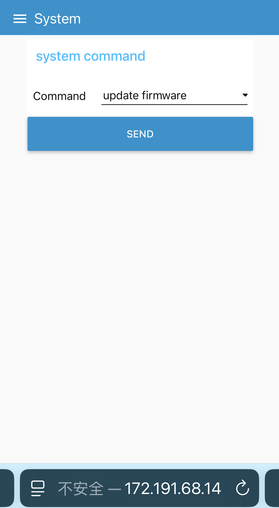

- Node-RED backend

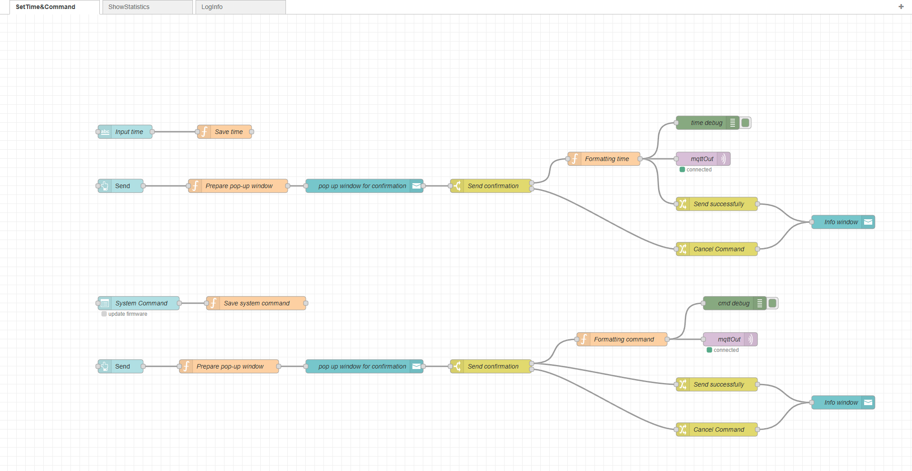

  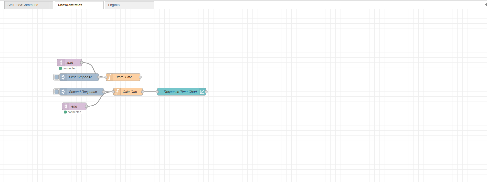
  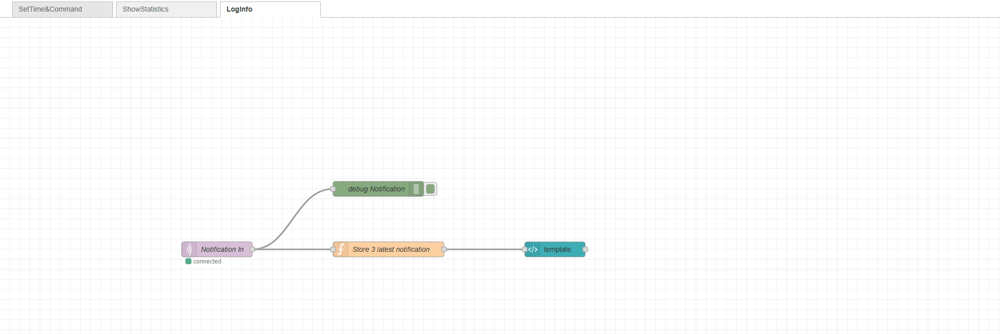

- Block diagram of the system

Initial version & final version:

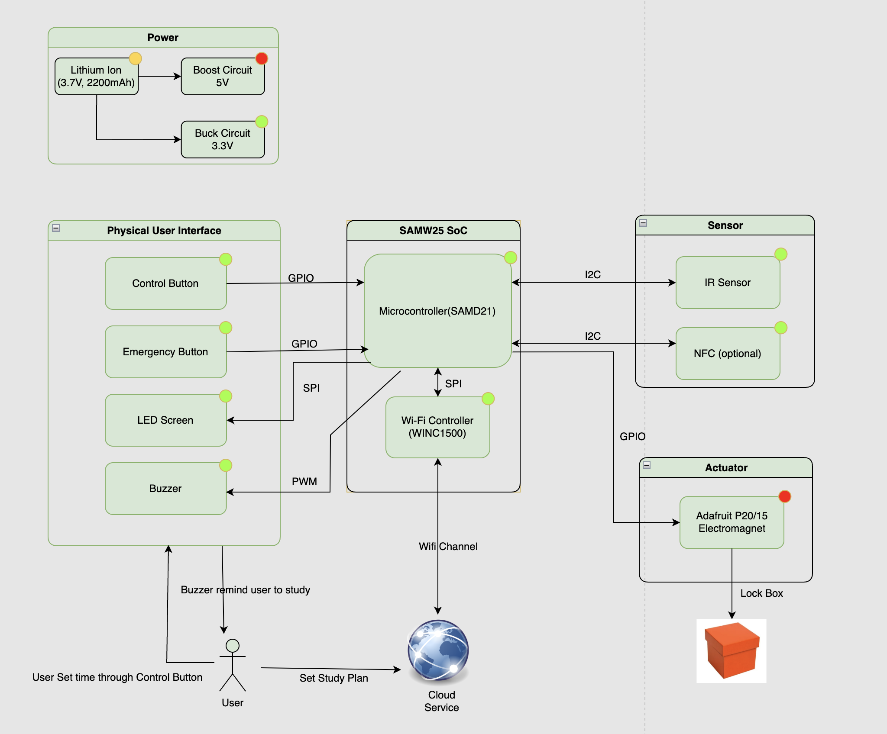

Final version (adding IMU & SD Card, update device logic)

- Power Block Diagram

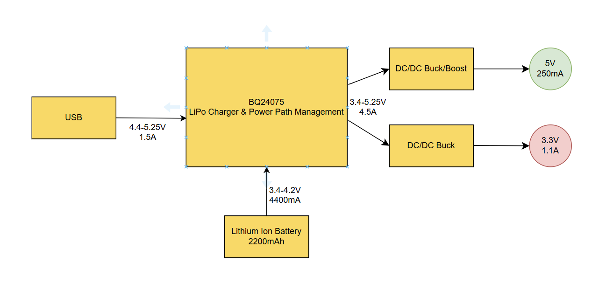

## 5. Codebase

- [Code folder](./Code/)

- [Node-RED dashboard code](http://172.191.68.14:1880)

No other software required.
