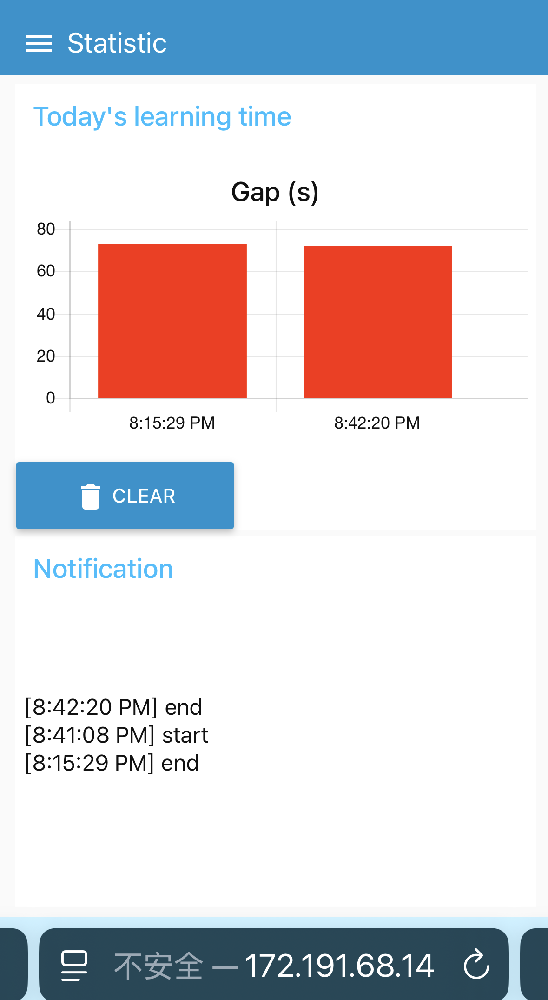
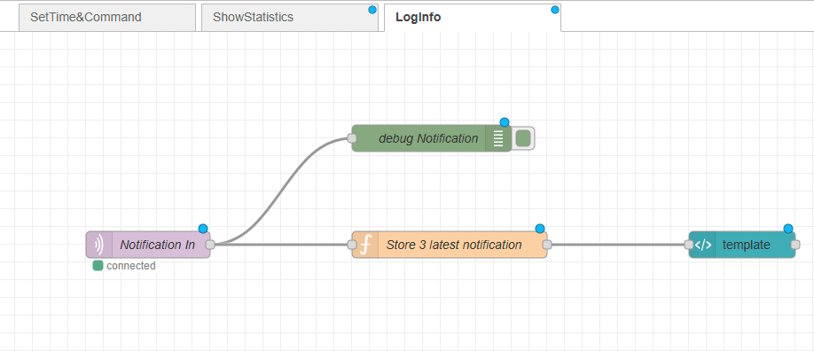

# a14g-final-submission

    * Team Number: 04
    * Team Name: Crazy Thursday
    * Team Members: Zheyu Li, Zhuozi Xie
    * Github Repository URL: https://github.com/ese5160/a14g-final-submission-s25-t04-crazy-thursday.git
    * Description of test hardware: SAMW25 on custom PCBA, Windows Laptop (Microchip Studio)

## 1. Video Presentation

Link to the video:

## 2. Project Summary

### 2.1 Device Description

- Describe our device in 2 sentences

    A phone locker that can lock your phone when you need to focus on your work. Set the learning time through our webUI, put the phone in the locker and it can't be taken out until the learning time has ended.

- What inspired we to do the project? What problem is our device solving?

    Many of us get distracted by our phones while studying, apps like TikTok and YouTube can be especially addictive. To help improve focus, we developed a timed locking box that securely holds your phone during study sessions, allowing you to concentrate without interruptions.

- How do you use the Internet to augment your device functionality?

    We use the Internet to enhance our device functionality by integrating it with a web interface, Node-Red, that allows users to remotely set study durations, monitor progress, and receive reminders.

### 2.2 Device Functionality

- Explain how your Internet-connected device is designed

- Include sensors, actuators, and other critical components.

- Include your system-level block diagram here.

    Our internet-connected device is designed with a modular task-based architecture to manage study sessions effectively. It uses an IR sensor to detect if a phone is placed inside the box, an IMU to monitor movement during study, and a supplementary limit switch to help detect the phone being placed inside the box. The electromagnetic lock secures the box, while a buzzer and LCD screen provide audio and visual feedback to the user. A button allows users to manually cancel sessions for emergency use. All these components are coordinated through a central System Control Task, which processes sensor data, user inputs, and commands from the WiFi Task. Through WiFi, the device connects to the Internet, enabling users to set lock durations, receive progress updates, and manage sessions remotely using Node-RED. This design ensures a seamless integration between hardware functionality and internet-based control.

### 2.3 Challenges

- Where did you face difficulties? This could be in firmware, hardware, software, integration, etc.

    We faced several challenges across both hardware and software components. On the hardware side, configuring the LCD with SERCOM3 SPI communication was particularly difficult and required extensive debugging. Instead of using the pin on the development board to connect the LCD one by one, we use the eye spi cable to connect them together. The eye spi simplify the pin connection, but increase the difficulty to debug. We do not know is the bug appear in the connection or the way we configure is wrong. There are too many factors to case the result. In terms of software, we encountered issues with firmware updates from the cloud, as neither the CLI commands nor the web-based instructions worked reliably. Additionally, we experienced stack overflows and memory limitations, since the system had only 32KB of RAM, which led to instability and task crashes during runtime.

- How did you overcome these challenges?

    To resolve the LCD communication issue, we carefully reviewed the SERCOM3 configuration and referred to the SPI setup in the A09G-1 example. We also used a logic analyzer on the MOSI and SCK pins to verify that SPI data was being transmitted correctly. To address memory constraints, we optimized usage by reducing task stack sizes, minimizing global variables, and increasing the FreeRTOS heap size manually to prevent allocation issues. We spent significant time fine-tuning task sizes to maintain a balance between functionality and stability. Additionally, for variables used only within local scopes, we added the const qualifier to store them in flash memory instead of consuming RAM. Regarding the firmware update failures, we believe they were caused by memory leaks. After optimizing memory usage, this issue was resolved automatically.
    
### 2.4 Prototype Learnings

- What lessons did you learn by building and testing this prototype?

    We learned that using a logic analyzer is extremely helpful for debugging, as it allows us to see exactly what’s happening on the chip and determine whether issues are caused by hardware or software. We also discovered the importance of thoroughly reading datasheets, which helped us understand how to properly configure and use various components. Searching for related examples online and on GitHub gave us valuable insights into how others approached similar problems and inspired our own code design. Finally, we realized that power management is a critical aspect of embedded system design, especially when working with wireless feature.

- What would you do differently if you had to build this device again?

    If we were to build this device again, we would use a bistable linear solenoid instead of an electromagnet, as it is simpler to control and consumes less power. We would also consider adding features like wireless charging at the bottom of the box to improve convenience. Additionally, we would integrate a physical pin pad to allow local lock and unlock functionality, providing an alternative to remote control and increasing reliability.

### 2.5 Next Steps & Takeaways

- What steps are needed to finish or improve this project?

    To improve this project, we plan to synchronize the device with cloud storage or Google Calendar to automatically log study sessions and help users track their productivity over time. We also aim to enhance the LCD display by showing more detailed information, such as better anime for remaining study time, session progress, and status messages, to provide a better user experience.

- What did you learn in ESE5160 through the lectures, assignments, and this course-long prototyping project?

    ESE5160 gave us a comprehensive, hands-on experience in embedded systems development—from concept to completion. We learned how to translate an idea into a concrete engineering goal. And how to choose appropriate components based on functionality, size, power consumption, and communication interfaces. Through lectures and assignments, we gained valuable skills in schematic design and PCB layout, which were both entirely new to us. Designing a PCB for the first time helped us understand the importance of pin assignments, trace routing, and physical board constraints.

    Once the PCB was manufactured, we experienced the challenges of hardware bring-up—testing the board, debugging connections, and integrating sensors, actuators, and microcontrollers. We also learned to use tools like logic analyzers, oscilloscopes, and serial debuggers to troubleshoot hardware-software interactions. Through the prototyping project, we appreciated the value of modular task-based firmware design, effective memory management, and real-world trade-offs between complexity, power, and performance. Overall, this course gave us the full product development experience and greatly improved our confidence in building real embedded systems.

### 2.6 Project Links

URL to the Node-RED instance:

http://172.191.68.14:1880/ui/

Share link to our final PCBA on Altium 365:

https://upenn-eselabs.365.altium.com/designs/2072B8AC-2960-444A-B440-9D8EECED0507

## 3. Hardware & Software Requirements

### HRS

- HRS 01 – Project shall be based on SAM W25 microcontroller (WiFi supported).

- HRS 02 – An IR sensor(via I2C) shall be used for phone detection. The sensor shall be able to accurately detect distances in the range of 1-10cm.

- HRS 03 – An 5V DC electromagnet with at least 2.5kg holding force shall be used to support the lock mechanism.

- HRS 04 – An LCD display shall be used for user interface. The display shall communicate with the microcontroller via SPI.

- HRS 05 – A passive buzzer that releases sounds of different frequencies shall be used.

- HRS 06 - A Li-Ion battery (3.7V nominal voltage) Shall be used as the power supply of the whole system.

- HRS 07 - A limit switch shall be used with IR sensor to cross validate that the cell phone is placed in the box

- HRS 08 - A 6-DOF IMU supporting I2C connection shall be used to detect whether the box has been moved or not，>10Hz sample rate is enough.

### SRS

- SRS 01 – The IR sensor and limit switch shall continuously detect the presence of objects inside the box when the time is set and before the box is closed(in Prepare Stage).

- SRS 02 - The Device shall receive commands from mobile phones using WiFi.

- SRS 03 - The box shall support setting study time using mobile phone (based on WiFi connection).

- SRS 04 - The electromagnet shall be controlled according to the status of IR sensor, limit switch and emergency release button.

- SRS 05 - The buzzer should play sound to inform the user to study when reaching the scheduled study time.

- SRS 06 - The buzzer should play sound to inform the user to rest when the setting time period end.

- SRS 07 - IMU's reading should determine the LCD on/off based on the box gesture during lock state.

## 4. Project Photos & Screenshots

Required photos and screenshots include:

- Final Project:

- The standalone PCBA, top

- The standalone PCBA, bottom

- Thermal camera images while the board is running under load:

- The Altium Board design in 2D view

- The Altium Board design in 3D view

- Node-RED dashboard(Phone view)

### Node-RED dashboard (Phone view)

  
  
  

- Node-RED backend

  
  

- Block diagram of the system

Initial version & final version:

Final version (adding IMU & SD Card, update device logic)

- Power Block Diagram

## 5. Codebase

- [Code folder](./Code/)

- [Node-RED dashboard code](http://172.191.68.14:1880)

No other software required.
