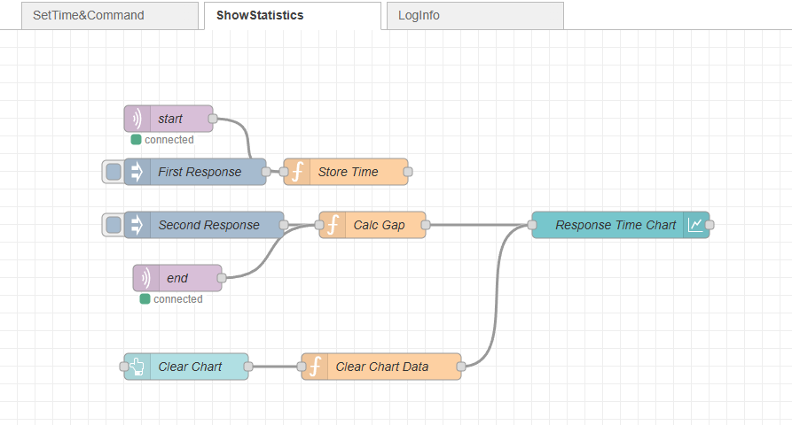

# a14g-final-submission

    * Team Number: 04
    * Team Name: Crazy Thursday
    * Team Members: Zheyu Li, Zhuozi Xie
    * Github Repository URL: https://github.com/ese5160/a14g-final-submission-s25-t04-crazy-thursday.git
    * Description of test hardware: SAMW25 on custom PCBA, Windows Laptop (Microchip Studio)

## 1. Video Presentation

Link to the video:

## 2. Project Summary

### 2.1 Device Description

- 2 sentence description of our device.

- What inspired we to do the project? What problem is our device solving?

    Many of us get distracted by our phones while studying, apps like TikTok and YouTube can be especially addictive. To help improve focus, we developed a timed locking box that securely holds your phone during study sessions, allowing you to concentrate without interruptions.

- How do you use the Internet to augment your device functionality?

    We use the Internet to enhance our device functionality by integrating it with a web interface, Node-Red, that allows users to remotely set study durations, monitor progress, and receive reminders.

- Device Functionality

    Our internet-connected device is designed with a modular task-based architecture to manage study sessions effectively. It uses an IR sensor to detect if a phone is placed inside the box, an IMU to monitor movement during study, and a supplementary limit switch to help detect the phone being placed inside the box. The electromagnetic lock secures the box, while a buzzer and LCD screen provide audio and visual feedback to the user. A button allows users to manually cancel sessions for emergency use. All these components are coordinated through a central System Control Task, which processes sensor data, user inputs, and commands from the WiFi Task. Through WiFi, the device connects to the Internet, enabling users to set lock durations, receive progress updates, and manage sessions remotely using Node-RED. This design ensures a seamless integration between hardware functionality and internet-based control.

- Next Steps & Takeaways

- What steps are needed to finish or improve this project?
    
    I think we can syncrinize our device with cloud storage or Google Calendar to log study sessions and track productivity over time.

- What did you learn in ESE5160 through the lectures, assignments, and this course-long prototyping project?

### 2.2 Device Functionality

- Explain how your Internet-connected device is designed

- Include sensors, actuators, and other critical components.

- Include your system-level block diagram here.

### 2.3 Challenges

- Where did you face difficulties? This could be in firmware, hardware, software, integration, etc.

- How did you overcome these challenges?

### 2.4 Prototype Learnings

- What lessons did you learn by building and testing this prototype?

- What would you do differently if you had to build this device again?

### 2.5 Next Steps & Takeaways

- What steps are needed to finish or improve this project?

- What did you learn in ESE5160 through the lectures, assignments, and this course-long prototyping project?

### 2.6 Project Links

URL to the Node-RED instance:

http://172.191.68.14:1880/ui/

Share link to our final PCBA on Altium 365:

https://upenn-eselabs.365.altium.com/designs/2072B8AC-2960-444A-B440-9D8EECED0507

## 3. Hardware & Software Requirements

### HRS

- HRS 01 – Project shall be based on SAM W25 microcontroller (WiFi supported).

- HRS 02 – An IR sensor(via I2C) shall be used for phone detection. The sensor shall be able to accurately detect distances in the range of 1-10cm.

- HRS 03 – An 5V DC electromagnet with at least 2.5kg holding force shall be used to support the lock mechanism.

- HRS 04 – An LCD display shall be used for user interface. The display shall communicate with the microcontroller via SPI.

- HRS 05 – A passive buzzer that releases sounds of different frequencies shall be used.

- HRS 06 - A Li-Ion battery (3.7V nominal voltage) Shall be used as the power supply of the whole system.

- HRS 07 - A limit switch shall be used with IR sensor to cross validate that the cell phone is placed in the box

- HRS 08 - A 6-DOF IMU supporting I2C connection shall be used to detect whether the box has been moved or not，>10Hz sample rate is enough.

### SRS

- SRS 01 – The IR sensor and limit switch shall continuously detect the presence of objects inside the box when the time is set and before the box is closed(in Prepare Stage).

- SRS 02 - The Device shall receive commands from mobile phones using WiFi.

- SRS 03 - The box shall support setting study time using mobile phone (based on WiFi connection).

- SRS 04 - The electromagnet shall be controlled according to the status of IR sensor, limit switch and emergency release button.

- SRS 05 - The buzzer should play sound to inform the user to study when reaching the scheduled study time.

- SRS 06 - The buzzer should play sound to inform the user to rest when the setting time period end.

- SRS 07 - IMU's reading should determine the LCD on/off based on the box gesture during lock state.

## 4. Project Photos & Screenshots

Required photos and screenshots include:

- Final Project:

- The standalone PCBA, top

- The standalone PCBA, bottom

- Thermal camera images while the board is running under load:

- The Altium Board design in 2D view

- The Altium Board design in 3D view

- Node-RED dashboard(Phone view)

### Node-RED dashboard (Phone view)

  
  
  

- Node-RED backend

  
  

- Block diagram of the system

Initial version & final version:

Final version (adding IMU & SD Card, update device logic)

- Power Block Diagram

## 5. Codebase

- [Code folder](./Code/)

- [Node-RED dashboard code](http://172.191.68.14:1880)

No other software required.
